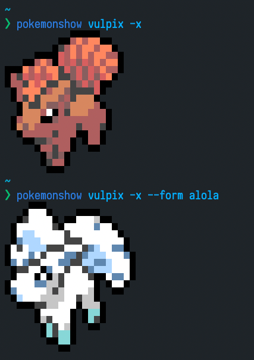

# pokemonshow

Shows a (random) Pokémon in your terminal!

# Installation

```
npm i -g pokemonshow
```

# Demo


# Usage

```
	Usage
	  $ pokemonshow <nameOrNumber>

	Options
		--xterm, -x  Show xterm instead of image in iTerm
		--say, -s Announces the name of the Pokémon
		--list Lists all the available Pokémon

	Examples
		$ pokemonshow
		$ pokemonshow pikachu
		$ pokemonshow 025 -x
		$ pokemonshow 025 -s
```

## About alternative forms

Some Pokémon have [different forms](https://bulbapedia.bulbagarden.net/wiki/Variant_Pok%C3%A9mon), thus different sprites. Since they _technically_ have the same name everytime, they can be referred using the filename that Bulbapedia uses for their sprite.

An example with [Vulpix](<https://bulbapedia.bulbagarden.net/wiki/Vulpix_(Pok%C3%A9mon)>) would look like this:

- "Regular" Vulpix
  - `pokemonshow vulpix`
- Alolan Vulpix
  - `pokemonshow vulpix-a`



Some recurring suffixes are:

- `-a` => Alola
- `-g` => Galar

There are a lot of small exceptions for all the different variations of Pokémon, the best solution is to run the following command to see all the variations of a given Pokémon:

```
pokemonshow --list | grep <name>
```

## About "special" names

Some Pokémon have names with special characters that are hard to type in a terminal. Examples of this are:

- Farfetch'd
- Mr. Mime
- Nidoran♂ and Nidoran♀
- Flabébé

In order to work around this, each Pokémon get an unique [slug](https://www.npmjs.com/package/slug) generated from their name, as such, the above examples become:

- Farfetch'd => `farfetch-d`
- Mr. Mime => `mr-mime`
- Nidoran♂ and Nidoran♀ => `nidoran-male` and `nidoran-female`
- Flabébé => `flabebe`

# Limitations

- The small images are only displayed on iTerm2 >= 3.x (using [term-img](https://github.com/sindresorhus/term-img)). All other terminals will default to the xterm files.

# Notice

Please notice I don't own Pokémon or anything related to it. Pokémon is property of [The Pokémon Company](https://en.wikipedia.org/wiki/The_Pok%C3%A9mon_Company).

# Contributing

You will need:

- NodeJS 12.x or newer
- npm

If you need to update the images and xterm files, you will need:

- ImageMagick
- [img2xterm](https://github.com/rossy/img2xterm) (this needs to be compiled from source)

Then run

```
npm run scrape && npm run make-xterm
```
